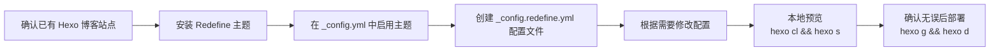

# 用Redefing主题美化Hexo博客
>  Hexo + Redefine 主题安装配置教程。
下面我会按「先决条件 → 安装主题 → 启用主题 → 创建配置文件 → 本地预览 → 常见进阶配置 → 常见问题」的顺序，每一步都给出具体命令和要点。
## 一、整体流程一眼看懂（先有个全局观）
下面是使用 Redefine 主题的大致步骤，你可以先扫一遍再跟着往下做。

如果你还没建好 Hexo 站点，可以先用 Hexo 官方文档建站，然后再回到本教程。Hexo 文档里也有“主题”部分的说明。
## 二、先决条件（开始之前先确认）
1) 已有一个能正常跑的 Hexo 博客
- 能在本地看到默认主题页面（http://localhost:4000 能打开）。
- 知道 Hexo 站点的“根目录”（即里面有 `_config.yml`、`source/`、`themes/` 的那个目录）。
2) 已安装 Node.js 和 Git（能正常用 npm / git）
- 不确定的话可以在终端运行：
  - `node -v`
  - `npm -v`
  - `git --version`
3) 建议提前装好一个顺手的编辑器
- 比如 VS Code，方便编辑 `.yml` / `.md` 文件。
## 三、安装 Redefine 主题（两种方式）
官方推荐通过 npm 安装，也支持通过 Git 克隆。这里给出两种方式，你任选其一即可，推荐方式一。
方式一：通过 npm 安装（推荐）
- 在 Hexo 根目录下打开终端（Git Bash / PowerShell / VS Code 终端均可），执行：
  ```bash
  npm install hexo-theme-redefine@latest
  ```
- 安装完后，主题会被放在 `node_modules/hexo-theme-redefine`，Hexo 会自动识别，不用你手动拷贝到 `themes/`。
方式二：通过 Git 克隆到 themes 目录（适合想改源码的人）
- 在 Hexo 根目录执行：
  ```bash
  git clone https://github.com/EvanNotFound/hexo-theme-redefine.git themes/redefine
  ```
- 克隆完后，`themes/` 下面会出现 `redefine` 文件夹。
两种方式最终要做的下一步都是：在 Hexo 的 `_config.yml` 中启用 Redefine。
## 四、启用 Redefine 主题
1) 打开站点配置文件
- 在 Hexo 根目录下找到 `_config.yml`（站点配置文件），用编辑器打开。
2) 修改 theme 字段
- 找到类似这样的配置（可能在比较靠下的位置）：
  ```yaml
  # Extensions
  ## Plugins: https://hexo.io/plugins/
  ## Themes: https://hexo.io/themes/
  theme: landscape
  ```
- 把 `theme` 的值改为：
  ```yaml
  theme: redefine
  ```
- 注意冒号后面要有一个空格，否则 Hexo 会识别错误。
3) 本地先看看效果（可选，但推荐）
- 在 Hexo 根目录执行：
  ```bash
  hexo clean && hexo s
  ```
- 打开浏览器访问 http://localhost:4000，能看到 Redefine 的默认界面就说明启用成功了。
## 五、创建主题配置文件 _config.redefine.yml（重要）
Redefine 官方推荐：不要直接改主题目录里的 `_config.yml`，而是在 Hexo 根目录下新建一个 `_config.redefine.yml`，用来覆盖主题默认配置。这样后续升级主题不会丢失你的自定义配置。
1) 新建文件
- 在 Hexo 根目录下新建文件：`_config.redefine.yml`
2) 从官方文档复制完整配置模板
- 打开 Redefine 官方“快速开始/Getting Started”文档中的配置内容（中文或英文都可以）：
- 把页面上的全部内容复制到你的 `_config.redefine.yml` 中。
  内容大致会类似这样（只截一小段示意）：
  ```yaml
  # Redefine 主题配置示例（示意，以官方文档为准）
  favicon: /favicon.ico
  logo:
    enable: true
    image: /logo.svg
    ...
  ```
3) 保存
- 保存 `_config.redefine.yml`，重启一下本地服务（`Ctrl+C` 停止后重新 `hexo cl && hexo s`），确保你的修改生效。
## 六、常用配置：按你的需求改一改
下面列出几个新手最常改的配置项，均在 `_config.redefine.yml` 中修改（以官方最新字段名为准，下面的只是典型示例）。
1) 网站基本信息
- 这些一般在 Hexo 的 `_config.yml`（站点配置）中设置，但部分主题也支持通过主题配置覆盖。
  - `title`：网站标题
  - `subtitle`：副标题
  - `description`：站点描述
  - `author`：作者名
  - `language`：语言（如 `zh-CN`）
  - `timezone`：时区（建议 `Asia/Shanghai`）
2) 导航菜单（顶部导航）
- 在 `_config.redefine.yml` 中找到类似 `navbar` / `menu` 段，示例：
  ```yaml
  navbar:
    - name: 首页
      url: /
    - name: 归档
      url: /archives
    - name: 标签
      url: /tags
    - name: 分类
      url: /categories
    - name: 关于
      url: /about
  ```
- 按需要增减菜单项即可，确保 `url` 对应你实际存在的页面路径。
3) 侧边栏 / 布局风格
- Redefine 提供不同布局（如是否显示侧边栏、侧边栏位置等），通常在 `sidebar` / `layout` 等配置段中设置。
- 你可以在官方文档里对照注释按需开关或调整。
4) 代码高亮 / 复制按钮 / 行号
- 一般在 `highlight` / `code_block` 等字段下：
  - 是否显示行号
  - 是否显示“复制”按钮
  - 高亮主题（如 `light` / `dark` / `default`）
5) 暗色模式 / 主题配色
- 可在 `colorscheme` 或 `dark_mode` 等配置段选择：
  - 自动跟随系统
  - 仅浅色/仅深色
  - 切换按钮样式等
6) 评论系统 / 统计 / 图床 等扩展
- 在配置文件中找到对应字段（如 `comments`、`analytics`、`avatar` 等），填入相应服务提供的 key / ID 即可：
  - 常见评论：Waline / Twikoo / Giscus 等（以你选用服务的官方文档为准）
  - 统计：百度统计 / Google Analytics / Cloudflare Web Analytics 等
所有这些配置，你都可以在 Redefine 官方文档里看到详细说明和示例配置，建议对照文档来改。
## 七、本地预览 & 调试步骤（每次修改后）
建议按下面的循环来调试：
1) 修改配置（`_config.redefine.yml` 或文章）  
2) 本地清理并重新生成
```bash
hexo clean && hexo s
```
3) 浏览器访问 http://localhost:4000 刷新查看效果  
4) 确认无误后，再部署到线上：
```bash
hexo clean && hexo g && hexo d
```
说明：
- `hexo clean`：清除缓存和旧的静态文件  
- `hexo g`（hexo generate）：生成静态文件  
- `hexo d`（hexo deploy）：部署到远端（GitHub / Gitee / Cloudflare Pages 等）
## 八、更新 Redefine 主题的推荐做法
- 如果你用 npm 安装主题（推荐），更新命令：
  ```bash
  npm update hexo-theme-redefine
  ```
- 因为你的自定义配置都在根目录的 `_config.redefine.yml`，所以更新主题不会覆盖你的配置，这也是官方推荐使用该文件的原因。
- 若使用 Git 克隆方式，可以在 `themes/redefine` 目录里执行 `git pull`，但不建议直接在这个目录改文件；最好通过 fork / 自建分支管理，以免后续合并麻烦。
## 九、常见问题 & 避坑指南
1) 启用 Redefine 后样式错乱 / 没有样式
- 排查步骤：
  1) 确认 `_config.yml` 中 `theme: redefine` 没写错（注意冒号后有空格）。  
  2) 确认已经安装了主题（npm 或 git clone）。  
  3) 本地执行 `hexo clean && hexo s` 重启。  
  4) 清理浏览器缓存（Ctrl+F5 强制刷新）。
2) 修改 `_config.redefine.yml` 没有生效
- 检查：
  - 文件名是否严格为 `_config.redefine.yml`（在根目录）。
  - 格式是否正确（YAML 缩进用空格，不要用 Tab）。
  - 每次修改后是否执行了 `hexo clean`。
3) 主题与 Hexo 版本不兼容
- 实战反馈：有用户测试发现 Hexo 7.0.0 会导致某些标签报错，建议暂时使用 `6.3.0` 等较稳定版本。  
- 可通过 `npm list hexo` 查看当前 Hexo 版本，必要时指定版本安装：
  ```bash
  npm install hexo@6.3.0
  ```
4) 想用 LaTeX 公式显示不全
- 需要安装额外插件：
  ```bash
  npm install hexo-filter-mathjax
  ```
- 在 Hexo 的 `_config.yml` 中添加 mathjax 配置，例如：
  ```yaml
  mathjax:
    tags: none       # 或 'ams' 或 'all'
    single_dollars: true
    cjk_width: 0.9
    ...
  ```
  具体配置以插件或主题文档为准。
5) 安装过程报“依赖缺失”或安装失败
- 确保 Hexo 版本在 5.0+，按官方推荐命令安装：
  ```bash
  npm install hexo-theme-redefine@latest
  ```
- 如仍然报错，尝试：
  ```bash
  npm install <缺少的依赖名>
  ```
## 十、进一步学习的建议
- 深入主题功能：
  - 首选“Redefine Docs 官方文档”，里面有从安装、配置、插件到自定义样式的完整说明（中文/英文都有）。
  - 配置时尽量“照着文档改字段”，不要自己乱起名字。
- 学习 Hexo 基础使用：
  - 如何创建文章、分类页、标签页；
  - 如何使用 Markdown 写作、插入图片、配置 Front Matter。
- 多实践、多备份：
  - 建议把你的博客源码（含 `_config.redefine.yml`）也用 Git 管理起来。
  - 每次大改动前先提交一个 commit，方便回滚。
如果你已经搭好了 Hexo 站点，并且把当前 `_config.yml` 和 `_config.redefine.yml` 的关键内容贴出来，我也可以帮你“对着现有配置”给一份更贴合你站的个性化修改建议。
